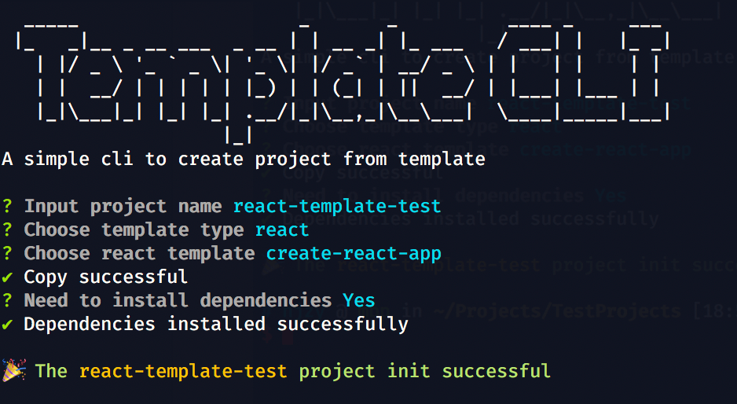

# template-cli

A simple cli to create project from template



## Features

- Created according to different project template types
- Can be created using local templates or remote templates
- Support download single template folder from Github without git clone whole project
- Rich custom configuration items

## Install

```bash
npm i -g template-cli
```

## Usage

```bash
template
```

```text
Usage: template [options] [command]

Options:
  -v,--version                   output the version number
  -h, --help                     display help for command

Commands:
  init [options] [projectName]   init project from template
  list [options] [templateType]  list template types or names
  config [options]               operating config
  help [command]                 display help for command
```

## Templates folder format

Whether it is a local templates or a remote templates, the first level in the folder is the template type, and the second level is the actual template

```bash
├── Electron
│   └── electron-quick-start
├── React
│   ├── create-next-app
│   └── create-react-app
└── Vue
    ├── create-nuxt-app
    └── vue-cli
```

## Config

The configuration file is stored in the user root directory by default

```bash
# show in explorer
template config -s
# open config
template config -o
# reset config
template config -r
```

## default config

```json
{
  "githubToken": "",
  "localTemplates": [],
  "remoteTemplates": [
    {
      "owner": "njzydark",
      "repo": "templates",
      "path": "",
      "type": "github"
    }
  ],
  "npmDependeniesInstall": {
    "auto": true,
    "silent": false,
    "manager": "npm"
  },
  "git": {
    "init": true,
    "firstCommit": ""
  },
  "editorOpen": {
    "name": "vscode",
    "command": "code",
    "enable": false
  }
}
```

### local templates

add `path` item to `localTemplates`, the path must be absolute path

```bash
"localTemplates": [
  {
    "path": "/Users/njzy/Projects/PersonalProjects/templates"
  }
],
```

### remote templates

The following is the [built-in remote template](https://github.com/njzydark/templates), you can remove and custom your own github templates repo

the `owner` `repo` `path` is the part of [Github Api](https://docs.github.com/en/rest/reference/repos#get-repository-content)

the `type` must currently be `github`

```bash
"remoteTemplates": [
  {
    "owner": "njzydark",
    "repo": "templates",
    "path": "",
    "type": "github"
  }
],
```
